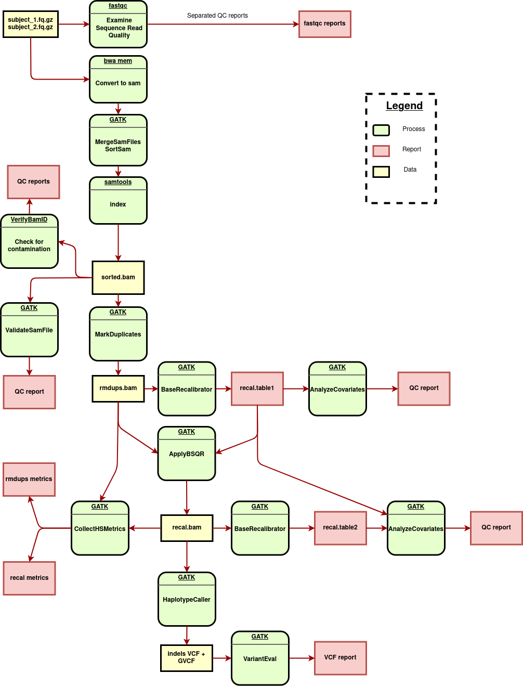

# WES

Parallel processing in python for the whole exome sequencing pipeline

## Python progs

There is two main python files in the bin directory. 

   * wes.py : Full pipeline paralelization
   * slurm.py : [SLURM calls helper](https://github.com/asqwerty666/slurm-modpy)

You can edit and execute the wes.py script but for simplicity I have divided into two diferent scripts,

   * preproc.py : Manage all individual pipelines and build the individual VCFs 
   * vcf\_proc.py : Combines individual VCF files into a single VCF with all info

## TO DO

   * Docs!

