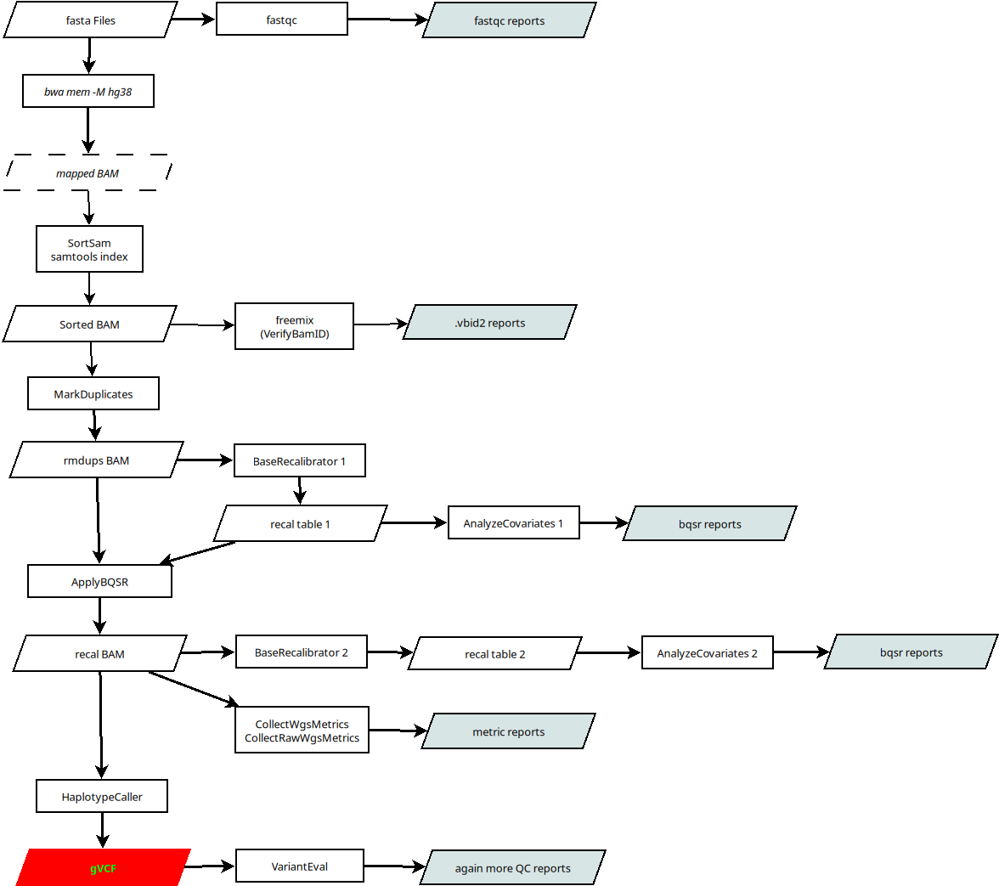

# WES

Parallel processing in python for the whole exome sequencing pipeline



## Python progs

There is tree main python files in the bin directory. 

   * slurm.py : [SLURM calls helper](https://github.com/asqwerty666/slurm-modpy)
   * preproc.py : Manage all individual pipelines and build the individual VCFs 
   * vcf\_proc.py : Combines individual VCF files into a single VCF with all info

## GET your references

First of all you will need to download your references from GATK bucket or something similar. I just downladed,
  
   * https://storage.googleapis.com/genomics-public-data/resources/broad/hg38/v0/Homo_sapiens_assembly38.fasta
   * https://storage.googleapis.com/genomics-public-data/resources/broad/hg38/v0/Homo_sapiens_assembly38.known_indels.vcf.gz
   * https://storage.googleapis.com/genomics-public-data/resources/broad/hg38/v0/Mills_and_1000G_gold_standard.indels.hg38.vcf.gz
   * https://storage.googleapis.com/genomics-public-data/resources/broad/hg38/v0/1000G_phase1.snps.high_confidence.hg38.vcf.gz
   * https://storage.googleapis.com/genomics-public-data/resources/broad/hg38/v0/Homo_sapiens_assembly38.dbsnp138.vcf
   * https://storage.googleapis.com/genomics-public-data/resources/broad/hg38/v0/hapmap_3.3.hg38.vcf.gz

and now you proceed to create your _dictionary_ file. OK, you can download it also, but this way it seems easy to me.

```
refs/index_ref.sh Homo_sapiens_assembly38.fasta
```

and now, let us make the _bait_ and _target_ files using this _dict_ and the design files from your suplier,

```
refs/make_bait.sh
```

Finally I'm going to index all the ref vcf files,

```
while read -r vcf; do gatk IndexFeatureFile -I ${vcf}; done < toindex.txt
```

So far is all ready to run the WES.

## Just go

Once you have everything in place, you probably want to edit the data paths inside the _preproc.py_ script.After everything is OK just do,

```
bin/preproc.py
```

and you can go to surf a couple of days while the script send the jobs to the schedule manager, collects result and so on. Eventually you will get an email with some warning about tasks finishing.

### Some options

The script has also some basic optional input options for do some testing in your sample,

   * --cut, -c : especify a file with a subsebt of the subjects to analyze, run the processing only on these subjects
   * --output, -o : especify where to storage the output
   * --source, -s : especify where to look for subject's fasta files

This command will run individual analysis. After that you will want to compile the whole DB, but only after checking everyting is finei. You could use the script,

  * *vcf_proc.py* : make full GVCF from individual files


## TO DO

   * More docs!


